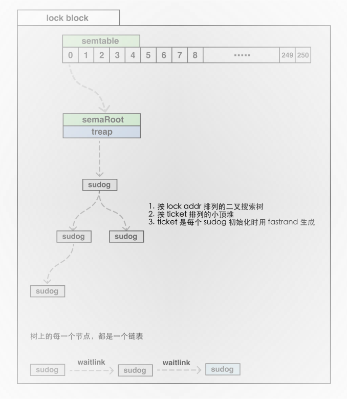
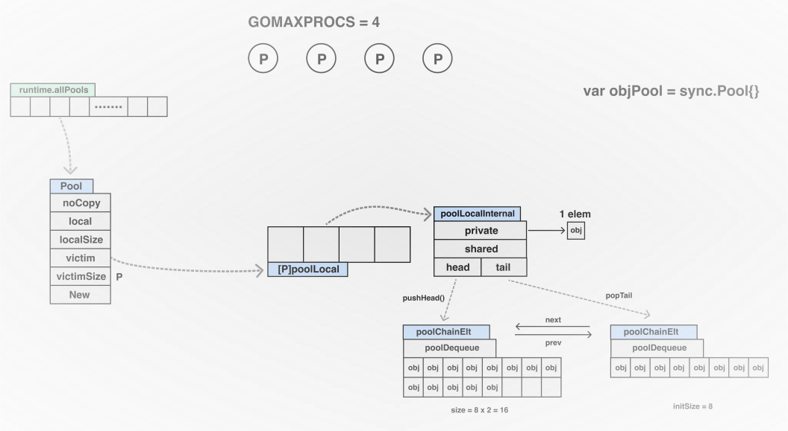

# Go 并发编程

## 同步原语

### `atomic`

#### 源码实现 `Go 1.22`

```go
// An Int32 is an atomic int32. The zero value is zero.
type Int32 struct {
    _ noCopy
    v int32
}

// Load atomically loads and returns the value stored in x.
func (x *Int32) Load() int32 { return LoadInt32(&x.v) }

// Store atomically stores val into x.
func (x *Int32) Store(val int32) { StoreInt32(&x.v, val) }

// Swap atomically stores new into x and returns the previous value.
func (x *Int32) Swap(new int32) (old int32) { return SwapInt32(&x.v, new) }

// CompareAndSwap executes the compare-and-swap operation for x.
func (x *Int32) CompareAndSwap(old, new int32) (swapped bool) {
    return CompareAndSwapInt32(&x.v, old, new)
}

// Add atomically adds delta to x and returns the new value.
func (x *Int32) Add(delta int32) (new int32) { return AddInt32(&x.v, delta) }
```

### Problems

1. `atomic` 相关的操作，底层都会有产生自旋的可能吗？

    > `atomic` 在 x86/64 平台下没有自旋，在 arm 平台可能会有。

2. `atomic` 相关的行为都是乐观锁的模式吗？

    > `for` 和 `atomic` 配对来实现无锁算法；`CAS` 可以称为乐观锁。

### `semaphore`

信号量，是锁实现的基础，也是所有同步原语的基础设施



#### 源码实现 `Go 1.22`

```go
// Asynchronous semaphore for sync.Mutex.

// A semaRoot holds a balanced tree of sudog with distinct addresses (s.elem).
// Each of those sudog may in turn point (through s.waitlink) to a list
// of other sudogs waiting on the same address.
// The operations on the inner lists of sudogs with the same address
// are all O(1). The scanning of the top-level semaRoot list is O(log n),
// where n is the number of distinct addresses with goroutines blocked
// on them that hash to the given semaRoot.
type semaRoot struct {
    lock  mutex
    treap *sudog        // root of balanced tree of unique waiters.
    nwait atomic.Uint32 // Number of waiters. Read w/o the lock.
}

var semtable semTable

// Prime to not correlate with any user patterns.
const semTabSize = 251

type semTable [semTabSize]struct {
    root semaRoot
    pad  [cpu.CacheLinePadSize - unsafe.Sizeof(semaRoot{})]byte
}
```

#### Problems

1. `semtable`、`semaRoot` 与 `sema` 三者之间的关系？

   > `sema` 是由一个个的 sudog 构成的 treap 结构（二叉搜索树）；`semaRoot` 是 treap 的根节点；
   >
   > `sematable` 中每一个元素位置都是 `sema` 的地址哈希得到，并且每一个元素（总共 251 个）都是一个 `sema`；

### `sync.Mutex`

互斥锁 Mutex exclusion，任何时间只允许一个 goroutine 在临界区运行.

* 零值是未加锁状态
* `Unlock` 未加锁的 Mutex 会 `panic`
* 加锁的 Mutex 与特定的 goroutine 不会进行关联
* 非重入锁

#### 实现逻辑

1. Mutex 有两种模式：**正常模式**和**饥饿模式**

2. 正常模式下，所有等待锁的 goroutine 按照 FIFO 顺序等待。

    唤醒的 goroutine 不会直接拥有锁，而是会和新请求锁的 goroutine 竞争。

    如果一个等待的 goroutine 超过 1ms 没有获取锁，那么锁的状态将转变为饥饿模式。

3. 饥饿模式下，锁的所有权将从 unlock 的 goroutine 直接交给等待队列中的第一个，新来的 goroutine 不会尝试获取锁，也不会尝试自旋操作，而是放在等待队列的末尾。

4. 如果一个等待的 goroutine 获取了锁，且满足以下任一条件，锁就会转变为正常模式：

   * 该 goroutine 是队列中的最后一个；
   * 该 goroutine 等待时间小于 1ms；

> `TryLock`, `Count`, `Iswoken`, `IsStarving`

#### 源码实现 `Go 1.22`

```go
type Mutex struct {
    state int32
    sema  uint32
}

const (
    mutexLocked = 1 << iota // mutex is locked
    mutexWoken
    mutexStarving
    mutexWaiterShift = iota

    starvationThresholdNs = 1e6
)

func (m *Mutex) Lock() {
    // Fast path: grab unlocked mutex.
    if atomic.CompareAndSwapInt32(&m.state, 0, mutexLocked) {
        if race.Enabled {
            race.Acquire(unsafe.Pointer(m))
        }
        return
    }
    // Slow path (outlined so that the fast path can be inlined)
    m.lockSlow()
}

func (m *Mutex) Unlock() {
    if race.Enabled {
        _ = m.state
        race.Release(unsafe.Pointer(m))
    }

    // Fast path: drop lock bit.
    new := atomic.AddInt32(&m.state, -mutexLocked)
    if new != 0 {
        // Outlined slow path to allow inlining the fast path.
        // To hide unlockSlow during tracing we skip one extra frame when tracing GoUnblock.
        m.unlockSlow(new)
    }
}
```

#### Problems

1. 如果 `sync.Mutex` 已被一个 goroutine 持有，此时另外一个 goroutine 加锁时，会进行自旋吗？

   > 会。因为在非饥饿模式下，新的 goroutine 优先级更高.

2. 如果多个 goroutine 竞争锁，抢不到的 goroutine 全被挂起，那么如何产生抢锁的唤醒行为呢？如何跟 GMP 关联起来？

    > `runtime_SemacquireMutex` -> `sync_runtime_SecmacquireMutex` -> `sync_runtime_SemacquireMutex` -> `semacquire1` -> `goparkunlock` -> `gopark` -> `mcall(park_m)` -> `schedule()`
    >
    > 其中 `schedule()` 就可以调度其他 goroutine
    >
    > wake 流程： `Unlock` -> `unlockSlow` -> `runtime_Semrelease` -> `sync_runtime_Semrelease` -> `semrelease1` -> `readyWithTime` -> `goready` -> `ready` -> `runqput` / `wakep()` / `releasem`

---

### `sync.RWMutex`

读写锁

* 可以被一堆 reader 持有，或唯一 writer 持有
* 适合大并发 reader 场景
* 零值是未加锁状态
* writer 相比后续 reader 的 RLock 优先级更高
* FIXME: 禁止递归读锁

> `ReaderCount`, `WriterCount`

#### 源码实现 `Go 1.22`

```go
type RWMutex struct {
 w           Mutex        // held if there are pending writers
 writerSem   uint32       // semaphore for writers to wait for completing readers
 readerSem   uint32       // semaphore for readers to wait for completing writers
 readerCount atomic.Int32 // number of pending readers
 readerWait  atomic.Int32 // number of departing readers
}

const rwmutexMaxReaders = 1 << 30

func (rw *RWMutex) RLock() {...}
func (rw *RWMutex) TryRLock() bool {...}
func (rw *RWMutex) RUnlock() {...}
func (rw *RWMutex) Lock() {...}
func (rw *RWMutex) TryLock() bool {...}
func (rw *RWMutex) Unlock() {...}
```

---

### `sync.Once`

* 只执行一次初始化 `func (o *Once) Do(f func())`
* 避免死锁
* 即使 `f` panic，Once 也认为其执行完成了

> 基于该同步原语可以实现**单例模式**

#### 源码实现 `Go 1.22`

```go
// Once is an object that will perform exactly one action.
type Once struct {
    // done indicates whether the action has been performed.
    done atomic.Uint32
    m    Mutex
}

func (o *Once) Do(f func()) {
 if o.done.Load() == 0 {
  // Outlined slow-path to allow inlining of the fast-path.
  o.doSlow(f)
 }
}
```

---

### `sync.Cond`

Mutex 有些情况下不适用，Monitor = Mutex + Condition Variables.

`sync.Cond` 是一组等待同一个条件的 goroutine 的容器，每个 `Cond` 和一个 `Locker`(`*Mutex` / `*RWMutex`) 相关联，改变条件或者调用 `Wait` 需要获取锁.

#### 源码实现 `Go 1.22`

```go
// Cond implements a condition variable, a rendezvous point
// for goroutines waiting for or announcing the occurrence
// of an event.
//
// Each Cond has an associated Locker L (often a *Mutex or *RWMutex),
// which must be held when changing the condition and
// when calling the Wait method.
type Cond struct {
    noCopy noCopy

    // L is held while observing or changing the condition
    L Locker

    notify  notifyList
    checker copyChecker
}

func NewCond(l Locker) *Cond {...}
func (c *Cond) Wait() {...}
func (c *Cond) Signal() {...}
func (c *Cond) Broadcast() {...}
```

---

### `sync.Waitgroup`

Waitgroup 等待一组 goroutine 完成（Java CountdownLatch/CyclicBarrier）.

* `Add` 参数可以是负值，但计数器小于 0 则会 panic
* 当计数器为 0 时，阻塞在 `Wait` 处的 goroutine 都会被释放
* 可重用
* 多次 `Wait` 不存在问题，但多次 `Done` 会因计数器值为负导致 panic

#### 源码实现 `Go 1.22`

```go
// A WaitGroup waits for a collection of goroutines to finish.
// The main goroutine calls Add to set the number of
// goroutines to wait for. Then each of the goroutines
// runs and calls Done when finished. At the same time,
// Wait can be used to block until all goroutines have finished.
type WaitGroup struct {
    noCopy noCopy

    state atomic.Uint64 // high 32 bits are counter, low 32 bits are waiter count.
    sema  uint32
}

func (wg *WaitGroup) Add(delta int) {...}
func (wg *WaitGroup) Done() { wg.Add(-1) }
func (wg *WaitGroup) Wait() {...}
```

---

### `sync.Pool`

临时对象池，可能在任何时候任意的对象都可能被移除，可以安全地并发访问，支持装箱/拆箱.

请求生命周期开始时，`pool.Get`；
请求结束时，`pool.Put`；

#### 主要应用场景

* 进程中的 inuse_object 数过多，**gc mark 消耗大量 CPU**
* 进程中的 inuse_object 数过多，**进程 RSS 占用过高**



#### 源码实现 `Go 1.22`

```go
// A Pool is a set of temporary objects that may be individually saved and
// retrieved.
//
// Any item stored in the Pool may be removed automatically at any time without
// notification. If the Pool holds the only reference when this happens, the
// item might be deallocated.
//
// A Pool is safe for use by multiple goroutines simultaneously.
//
// Pool's purpose is to cache allocated but unused items for later reuse,
// relieving pressure on the garbage collector. That is, it makes it easy to
// build efficient, thread-safe free lists. However, it is not suitable for all
// free lists.
//
// An appropriate use of a Pool is to manage a group of temporary items
// silently shared among and potentially reused by concurrent independent
// clients of a package. Pool provides a way to amortize allocation overhead
// across many clients.
//
// An example of good use of a Pool is in the fmt package, which maintains a
// dynamically-sized store of temporary output buffers. The store scales under
// load (when many goroutines are actively printing) and shrinks when
// quiescent.
//
// On the other hand, a free list maintained as part of a short-lived object is
// not a suitable use for a Pool, since the overhead does not amortize well in
// that scenario. It is more efficient to have such objects implement their own
// free list.
type Pool struct {
    noCopy noCopy

    local     unsafe.Pointer // local fixed-size per-P pool, actual type is [P]poolLocal
    localSize uintptr        // size of the local array

    victim     unsafe.Pointer // local from previous cycle
    victimSize uintptr        // size of victims array

    // New optionally specifies a function to generate
    // a value when Get would otherwise return nil.
    // It may not be changed concurrently with calls to Get.
    New func() any
}

// Local per-P Pool appendix.
type poolLocalInternal struct {
    private any       // Can be used only by the respective P.
    shared  poolChain // Local P can pushHead/popHead; any P can popTail.
}

func (p *Pool) Put(x any) {...}
func (p *Pool) Get() any {...}
```

#### Problems

1. `sync.Pool` 在其他 P 的 share 中获取任务会加锁吗？

    > 在 Go 语言中，`sync.Pool` 的设计是为了减少锁的使用以提高性能。
    > 当从 `sync.Pool` 中获取对象时，会先从当前 P 的 `private` 字段获取，如果 `private` 是空的，则会尝试从当前 P 的 `shared` 字段获取。
    > 如果当前 P 的 `shared` 也是空的，它会调用 `getSlow()` 方法，遍历每一个 P 的 `shared` 字段，只要发现某个 P 的 `shared` 字段有值，就会获取该 `shared` 的共享对象列表的最后一个并返回，而整个过程是无锁的。
    >
    > 然而，当其他 P 的 `shared` 也不存在可用对象时，则会进行“窃取”操作，这时可能设计加锁，因为 `sync.Pool` 的 `pin()` 方法在操作全局唯一的 `allPools` 时会加锁。

---

### `sync.Map`

[Map](https://www.figma.com/proto/FMzUIdkjm4BEHSpwWFecew/concurrency?page-id=6%3A15&node-id=6%3A16&viewport=-46%2C368%2C0.5078045725822449&scaling=min-zoom)，`Range` 进行遍历，可能会加锁，没有 `Len` 方法且不会添加

#### 源码实现 `Go 1.22`

```go
// Map is like a Go map[any]any but is safe for concurrent use
// by multiple goroutines without additional locking or coordination.
// Loads, stores, and deletes run in amortized constant time.
type Map struct {
    mu Mutex
    read atomic.Pointer[readOnly]
    dirty map[any]*entry
    misses int
}

// readOnly is an immutable struct stored atomically in the Map.read field.
type readOnly struct {
    m       map[any]*entry
    amended bool // true if the dirty map contains some key not in m.
}

// expunged is an arbitrary pointer that marks entries which have been deleted
// from the dirty map.
var expunged = new(any)

// An entry is a slot in the map corresponding to a particular key.
type entry struct {
    p atomic.Pointer[any]
}

func (m *Map) Load(key any) (value any, ok bool) {...}
func (m *Map) Store(key, value any) {...}
// LoadOrStore returns the existing value for the key if present.
// Otherwise, it stores and returns the given value.
// The loaded result is true if the value was loaded, false if stored.
func (m *Map) LoadOrStore(key, value any) (actual any, loaded bool) {...}
// LoadAndDelete deletes the value for a key, returning the previous value if any.
// The loaded result reports whether the key was present.
func (m *Map) LoadAndDelete(key any) (value any, loaded bool) {...}
func (m *Map) Delete(key any) {...}
// Swap swaps the value for a key and returns the previous value if any.
// The loaded result reports whether the key was present.
func (m *Map) Swap(key, value any) (previous any, loaded bool) {...}
// CompareAndSwap swaps the old and new values for key
// if the value stored in the map is equal to old.
// The old value must be of a comparable type.
func (m *Map) CompareAndSwap(key, old, new any) bool {...}
// CompareAndDelete deletes the entry for key if its value is equal to old.
// The old value must be of a comparable type.
//
// If there is no current value for key in the map, CompareAndDelete
// returns false (even if the old value is the nil interface value).
func (m *Map) CompareAndDelete(key, old any) (deleted bool) {...}
// Range calls f sequentially for each key and value present in the map.
// If f returns false, range stops the iteration.
//
// Range does not necessarily correspond to any consistent snapshot of the Map's
// contents: no key will be visited more than once, but if the value for any key
// is stored or deleted concurrently (including by f), Range may reflect any
// mapping for that key from any point during the Range call. Range does not
// block other methods on the receiver; even f itself may call any method on m.
//
// Range may be O(N) with the number of elements in the map even if f returns
// false after a constant number of calls.
func (m *Map) Range(f func(key, value any) bool) {...}
```

#### Problems

1. `sync.Map` 设计 read 和 dirty 的目的是什么？为什么分开设计？

    > * 采用 `Map` + `Mutex` 的设计时，CPU 多核扩展性较差
    > * `sync.Map` 采用 read 和 dirty 设计，在读多写少的情况下，基本上不需要加锁
