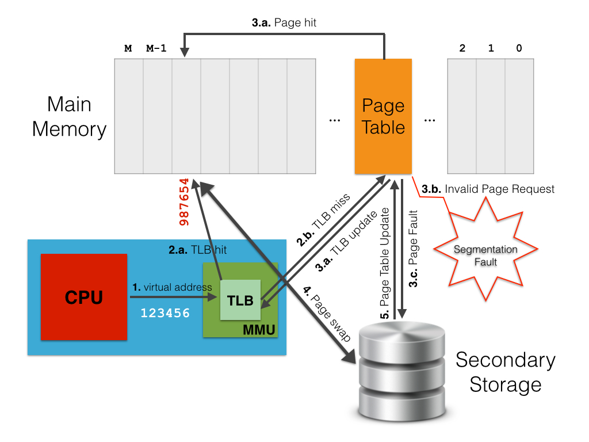
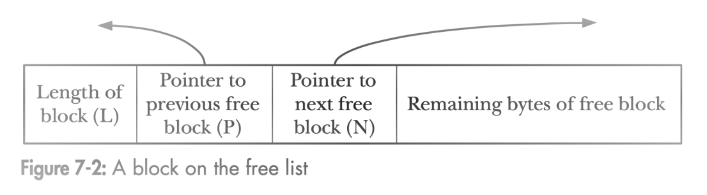
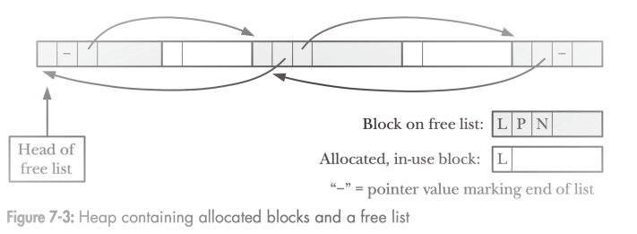
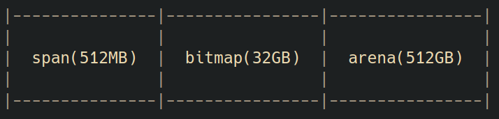
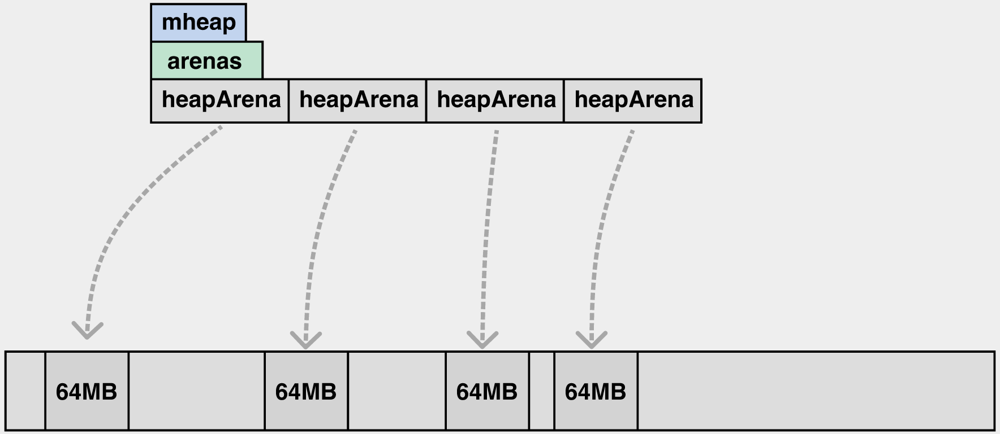
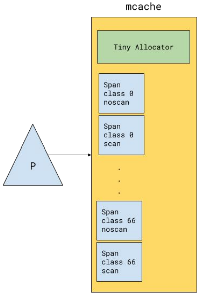
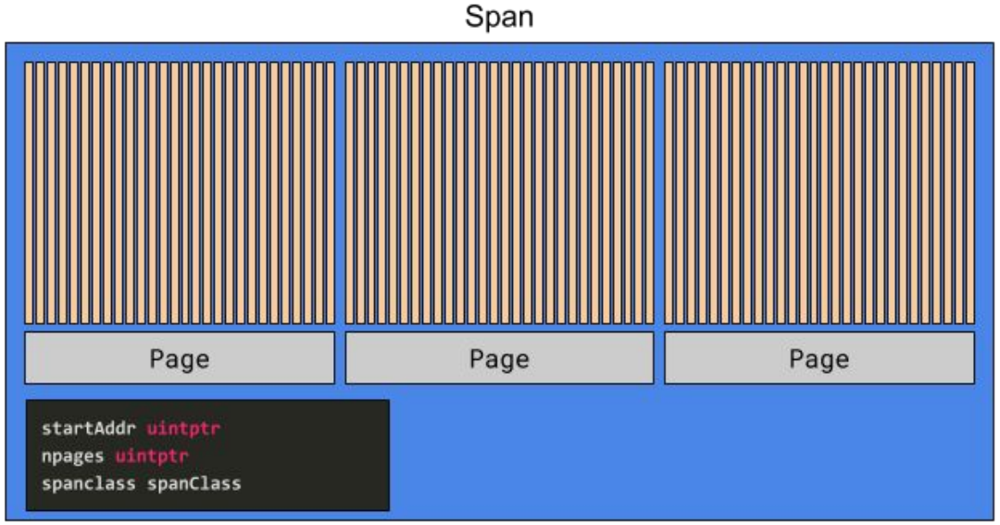
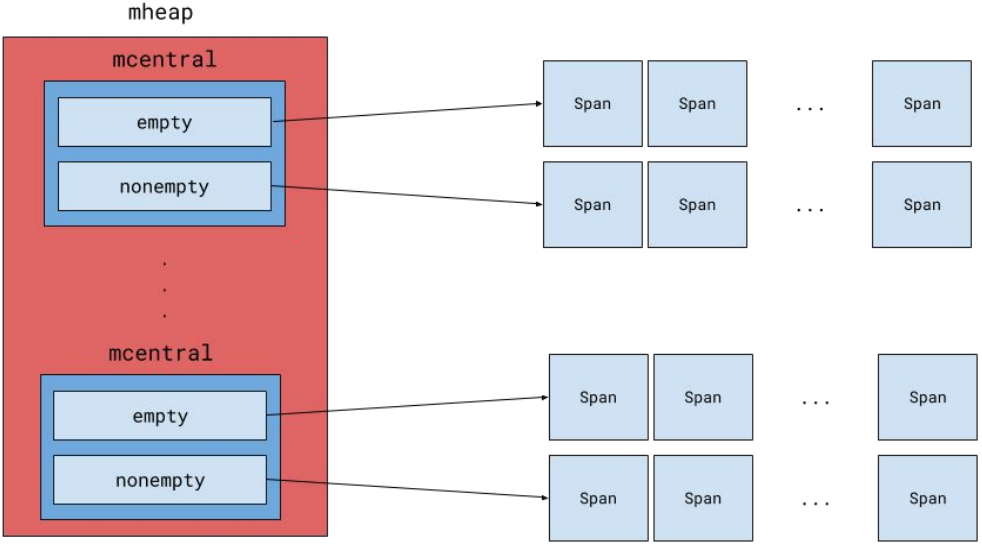

# Memory Management & Garbage Collection

## 栈上内存分配

[**栈分配，函数调用返回后，函数栈帧自动销毁（SP下移）**](https://www.figma.com/proto/tSl3CoSWKitJtvIhqLd8Ek/memory-management-and-and-garbage-collection?page-id=101%3A2&node-id=117%3A113&viewport=227%2C187%2C0.2501279413700104&scaling=contain)

## 堆上内存分配

在Go语言中，由于**Escape Analysis(逃逸分析)**的存在，从而无需担心*悬垂指针（Dangling Pointer）*

### 逃逸实例

   ```go
   // escape.go
   package main

   func main() {
      var m = make([]int, 10240)
      println(m[0])
   }
   ```

   ```shell
   $ go build -gcflags="-m" escape.go
   # command-line-arguments
   ./escape.go:3:6: can inline main
   ./escape.go:4:17: make([]int, 10240) escapes to heap
   ```

### 逃逸的可能性

[官方的相关escape测试](https://github.com/golang/go/blob/master/test/)

源码：`cmd/compile/internal/gc/escape.go`

## Go 内存管理

### 基本概念

Mutator: fancy word for application，就是应用程序，它会不断地修改对象的引用关系，即对象图.

Allocator：内存分配器，负责管理从操作系统中分配出的内存空间，`malloc`其实底层就有一个内存分配器的实现（`glibc`中），`tcmalloc（Thread-Caching Malloc）`是`malloc`的多线程改进版，Go 中的实现类似`tcmalloc`.

Collector：垃圾收集器，负责清理死对象，释放内存空间.


### 进程虚拟内存布局

前提假设：以下内存布局：**32-bit x86 Linux architecture**

**在 32-bit 多任务操作系统中，每一个进程都有自己的虚拟地址空间，其大小总是一个 4GB 的内存地址块。**
实际上，由于CPU可寻址的最小单位是**1 byte = 8 bit**，因此32-bit CPU能够访问多达 $2^{32}-1$ 个地址，其中每一个地址都对应着一个byte。
然后，CPU生成的虚拟地址通过 **页表(由操作系统内核保存)** 映射到真实的物理内存地址。

  

由于操作系统内核本身就是一个进程，具有虚拟地址空间的专用部分，并与为任何其他用户的应用程序进程（不是操作系统进程）保留的部分分开。

- **Text**:
   文本段，也称代码段，是包含程序可执行指令的内存部分。
   通常，代码段是可以共享的，因此对于经常执行的程序（如文本编辑器、C 编译器、shell等），只需要在内存中保留一个副本。
   另外，代码段通常处于 Read-only/Execute 状态，防止程序意外修改其指令。

- **Data**:
   数据段，是“初始化数据段”的简写，通常用来放置程序初始化的全局变量和静态变量。
   一般情况下，数据段不是 Read-only 的状态，因变量的值在运行时可以更改。
   实际上，数据段可以进一步划分为“初始化 Read-only”区域（RoData）和“初始化 Read-Write”区域。

- **BSS**:
   采用的是一个古老的汇编器运算符命名，代表“由符号启动的块”，指的是“未初始化的数据段”。
   在程序开始执行之前，此段中的数据由操作系统内核初始化算术0。
   通常，BSS段从Data的末尾开始，包含初始化为零或在源代码中没有显式初始化的所有全局变量和静态变量。
   BSS段是 Read-Write。

- **Stack**:
   栈区，通常位于操作系统内核空间正下方的较高内存地址中（称为随机堆栈偏移的常量偏移量除外）。
   在标准的 x86 架构中，该段向下增长到较低的地址。
   该段专门用于在程序中存储函数调用所需的所有数据，包括函数范围内的局部变量、调用方的返回地址等。
   栈指针寄存器(x86: `%esp`)跟踪栈的顶部（即进程当前使用的栈区大小），并且每次进行压栈操作都会进行调整，如果栈指针与堆指针相遇（或者达到 RLIMIT_STACK 的限制），则可用内存耗尽。

- **Heap**：
   堆区，通常用于动态内存分配，即为程序员请求的变量分配内存，这些变量的大小只能在运行时知晓，且编译器在程序执行之前无法静态确定。
   堆区从BSS段末尾开始，向上增长到更高的内存地址，由`malloc`/`new`、`free`/`delete`管理，可以使用`brk`和`sbrk` 系统调用来调整其大小。
   该区域由进程中所有的共享库和动态加载的模块共享。

### Allocator

[Bump/Sequential Allocator](https://www.figma.com/proto/tSl3CoSWKitJtvIhqLd8Ek/memory-management-and-and-garbage-collection?page-id=175%3A118&node-id=175%3A119&viewport=-7626%2C499%2C0.4998303949832916&scaling=contain)

[Free List Allocator](https://www.figma.com/proto/tSl3CoSWKitJtvIhqLd8Ek/memory-management-and-and-garbage-collection?page-id=233%3A21&node-id=233%3A22&viewport=-650%2C182%2C0.059255365282297134&scaling=min-zoom)

### malloc 实现

1. 当执行 `malloc` 时，将根据申请的内存空间大小 $n$ 调用不同的 `syscall`:

   - $n < 128KB$ 时，将采用 `brk` 系统调用，该系统调用只能通过调整 program break 位置推动堆增长
   - $n >= 128KB$ 时，将采用 `mmap` 系统调用，该系统调用可以在任意未分配的位置映射内存

2. 还可以通过 `mallopt` 系统调用修改阈值，即 128KB

  

### Go 的内存分配

老版本采用的是**连续堆**，结构如下：



新版本采用的是**稀疏堆**，结构如下：



[Heap 的增长](https://www.figma.com/proto/tSl3CoSWKitJtvIhqLd8Ek/memory-management-%26%26-garbage-collection?page-id=151%3A36&node-id=151-306&viewport=241%2C543%2C0.2360718995332718&scaling=contain)

**根据内存分配大小分类**：

- Tiny: size < 16bytes && has on pointer(noscan)

   [Tiny alloc 示意图](https://www.figma.com/proto/tSl3CoSWKitJtvIhqLd8Ek/memory-management-and-and-garbage-collection?page-id=165%3A81&node-id=165%3A197&viewport=-20163%2C1534%2C2.7550384998321533&scaling=scale-down)
- Small: has pointer(scan) || (size > 16bytes && size <= 32KB)

   Small alloc 与 Tiny alloc 相比，除了不存在 **`tiny`** 和 **`tinyoffset`** 之外，二者并无其他差异。
- Large: size > 32KB

   Large alloc 会直接越过 mchahe、mcentral，直接从 mheap 进行相应数量的 page 分配。

内存分配器在 Go 语言中维护了一个多级结构：**mchahe -> mcentral -> mheap**

- mcache: 与 P 绑定，本地内存分配操作，不需要加锁
- mcentral: 中心分配缓存，分配时需要上锁，不同 spanClass 使用不同的锁
- mheap: 全局唯一，从 OS 申请内存，并修改其内存定义结构时，需要加锁（全局锁）

[Go 堆内存数据结构总览](https://www.figma.com/proto/tSl3CoSWKitJtvIhqLd8Ek/memory-management-%26%26-garbage-collection?page-id=146%3A0&node-id=165-0&viewport=-457%2C167%2C0.1964392513036728&scaling=contain)

  

---

### Go 的 GC

#### 垃圾分类

- 语义垃圾（semantic garbage），也被成为内存泄露，指的是从语法上可达（通过局部、全局变量引用）的对象，但从语义上来讲是垃圾，**垃圾回收器对此无能为力**；

   [slice 语法垃圾实例](https://www.figma.com/proto/tSl3CoSWKitJtvIhqLd8Ek/memory-management-and-and-garbage-collection?page-id=185%3A2&node-id=185%3A13&viewport=-45%2C330%2C0.1481591761112213&scaling=contain)
- 语法垃圾（syntactic garbage），指的是从语法上无法到达的对象，是垃圾回收器主要收集的目标。

   ```go
   // alloc_on_heap.go
   package main
   
   func main() {
      allocOnHeap()
   }
   
   func allocOnHeap() {
      var a = make([]int, 10240) // 该函数返回后，a 便再无法访问，便成为了语法垃圾
      println(a)
   }
   ```

   ```shell
   $ go run -gcflags="-m" alloc_on_heap.go
   # command-line-arguments
   ./alloc_on_heap.go:7:6: can inline allocOnHeap
   ./alloc_on_heap.go:3:6: can inline main
   ./alloc_on_heap.go:4:16: inlining call to allocOnHeap
   ./alloc_on_heap.go:4:16: make([]int, 10240) escapes to heap
   ./alloc_on_heap.go:8:17: make([]int, 10240) escapes to heap
   [10240/10240]0xc000092000
   ```

#### GC 算法

常见的垃圾回收算法：
[GC算法可视化](https://spin.atomicobject.com/visualizing-garbage-collection-algorithms/)

- 引用计数（Reference Counting）：某个对象的根引用计数变为 0 ，其所有子节点均需要被回收；
- 标记压缩（Mark-Compact）：将存活对象移动到一起，解决内存碎片问题；
- 复制算法（Copying）：将所有正在使用的对象从 `From` 复制到 `To` 空间，堆利用率只有一半；
- 标记清扫（Mark-Sweep）：解决不了内存碎片问题，需要与能尽量避免内存碎片的分配器配合使用，如 tcmalloc，Go 采用的就是该算法。

#### Go 语言垃圾回收

##### 基本流程

[扫描标记流程](https://www.figma.com/proto/tSl3CoSWKitJtvIhqLd8Ek/memory-management-%26%26-garbage-collection?page-id=0%3A1&node-id=2-38&viewport=124%2C371%2C0.11918419599533081&scaling=contain)

**Mark-Sweep**算法

**Mark phase**: Start from roots (global variables and goroutine stacks) and mark each reachable object as alive.

**NOTE (注意事项)**:

1. 对象在标记过程中不能丢失；
2. Mark 阶段 mutator 的指向堆的指针修改需要被记录下来；
3. GC Mark 的 CPU 控制要努力做到 25% 以内；

**Sweep phase**: Check each allocated object, freeing it if it is not marked.

#### Tricolor Mark & Sweep

- **white set**: 白色，未扫描（对象未标记），Collector 不知道任何相关消息；
- **Grey set**: 灰色，已经扫描完毕（对象被标记），子节点未扫描（子对象未标记），即 gcmarkbits = 1 且在队列内；
- **Black set**: 黑色，已经扫描完毕（对象被标记），子节点扫描完毕（子对象被标记），即 gcmarkbits = 1 且在队列外；

**问题**：
[标记过程中对象漏标现象，导致对象被意外回收](https://www.figma.com/proto/tSl3CoSWKitJtvIhqLd8Ek/memory-management-%26%26-garbage-collection?page-id=16%3A150&node-id=23-117&viewport=373%2C377%2C0.3335455358028412&scaling=contain)

> **标记过程中对象丢失的解决方案**：
>
> 1. 强三色不变性（Strong Tricolor Invariant），禁止黑色对象指向白色对象；
> 2. 弱三色不变性（Weak Tricolor Invariant），黑色对象可以指向白色对象，则需存在灰色对象到该白色对象的可达路径；

#### **Write Barrier**

Barrier(屏障)本质是：**snippet of code insert before pointer modify(在指针修改前插入的一个函数调用)**

如果在所有指针操作中都加入 Dijkstra Barrier 或 Yuasa Barrier，就可以避免对象丢失，但实际的实现并非如此，Why？

> 由于栈的操作频率极高，因此 Go 在栈上指针操作是不加 barrier 的。

Slot 是 Go 代码里的被修改的指针对象，Ptr 是 Slot 要修改成的值。

- [Dijkstra Barrier](https://www.figma.com/proto/tSl3CoSWKitJtvIhqLd8Ek/memory-management-and-and-garbage-collection?page-id=201%3A0&node-id=201%3A1&viewport=250%2C361%2C0.06411547213792801&scaling=contain)

   ```go
   func DijkstraWB(slot *unsafe.Pointer, ptr unsafe.Pointer) {
      shade(ptr)
      *slot = ptr
   }
   ```

   优点：

   - 能够保证堆上对象的强三色不变性（无栈对象参与时）
   - 能防止指针从栈被隐藏进堆

   缺点：不能防止栈上对象的黑色对象指向堆上的白色对象(之前被堆上的黑/灰对象所指)，因此在 Mark 结束后需要 STW 重新扫描所有 GORoutine 栈.

- [Yuasa Barrier](https://www.figma.com/proto/tSl3CoSWKitJtvIhqLd8Ek/memory-management-and-and-garbage-collection?page-id=201%3A293&node-id=201%3A294&viewport=347%2C468%2C0.4064616858959198&scaling=contain)

   ```go
   func YuasaWB(slot *unsafe.Pointer, ptr unsafe.Pointer) {
      shade(*slot)
      *slot = ptr
   }
   ```

   优点：

   - 能够保证堆上的弱三色不变性（无栈对象参与时）
   - 能防止指针从堆被隐藏进栈（因为堆上断开的连接都会被着色）

   缺点：不能防止堆上的黑色对象执行堆上的白色对象（之前被栈上的黑/灰对象所指），因此需要 GC 开始时 STW 对栈做快照.

Go 中采用的是混合屏障，会将指针（指向堆的）修改前指向的位置和修改后指向的位置都标灰，具体代码在 `gcWriteBarrier` 汇编函数中。

### Reference

1. [Memory Management](https://www.kernel.org/doc/html/latest/arch/x86/x86_64/mm.html)

2. [MMU](https://gabrieletolomei.wordpress.com/miscellanea/operating-systems/virtual-memory-paging-and-swapping/)

3. [Memory layout](https://gabrieletolomei.wordpress.com/miscellanea/operating-systems/in-memory-layout/)

## Question

1. 全局变量是不是用于不会被GC回收？

   是的。

   - 由于全局变量一定隶属于某一个`package`，意味着在整个程序执行期间总是可以访问该全局变量，因此不会被GC。
   - 全局对象也是根对象的一种。

2. Go 1.8 之后，采用了混合屏障防止**黑色新指向白色且被灰色不可达**导致的数据丢失。

3. 混合屏障只优化了重新扫描栈，没有优化延迟清理，因此，标记期间新生成的对象都是黑色的，需要等下一个 GC 周期扫描和 sweep

4. `m0`是什么？主要做什么？

   `m0`就是`runtime.main`主线程，只能执行主线程的代码，该线程退出则整个进程退出。

   `m0` 需要P才可以执行，只有`sysmon`线程不需要P就可以执行。

5. channel 实现中，“直接拷贝”发生在什么时候？

   runtime/chan.go中的函数`func sendDirect(t *_type, sg *sudog, src unsafe.Pointer)`

6. `defer` 实现原理是什么？开放编码如何理解？

   `defer` 老版本采用的是链表的数据结构；
   Go 1.14 新版本，使用的是开放编码（open coded defer），依次检查bit位 + 普通函数调用，当函数内中`defer`不超过8个时，就会采用；

7. 在一轮 GC 标记开始前，需要保证 gcmarkbits 都是空的，不要受上一轮的影响

8. GC 的触发时机？

   `mallocgc` 分配内存触发
